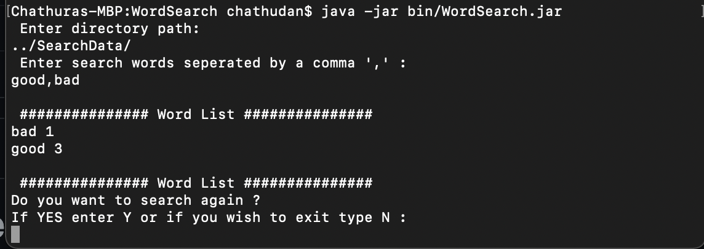

# Word Search 

search through a directory of files that is able to search for set of unique strings. 


## Run the script 

1. Navigate to bin folder in command line 
2. Run 
    ```java 
    java -jar WordSearch.jar
    ```
 3. Enter a valid directory path.
     ``` shell script
    ../SearchData/
     ```
 4. Enter a comma "," separated words to search. 
     ```
    good, bad
    ```
 
 